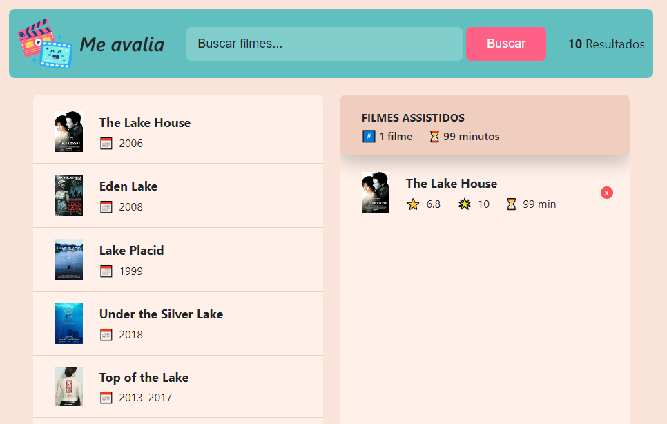

<h1 align="center">
    Me Avalia
</h1>

<h1 align="center">

  </h1>

<h3 align="center">
    <a href="https://me-avalia-ju.netlify.app/">Access demo page</a>
<h3 >

# Index

- [About](#-about)
- [Technologies used](#-technologies-used)
- [How to install and run the project](#-how-to-install-and-run-the-project)

## 🔖&nbsp; About

The "Me Avalia" is an application that allows the user to search for films they have already watched directly in an API. And besides, it is possible to obtain the details of this film and make a rating. The films he rated will be saved in a list. It is a project created in order to practice some features from React.

---

## 🚀 Technologies used

The project was developed using the following technologies

- Semantic HTML5 markup
- CSS
- JavaScript
- ReactJS
- VS Code

---

## 🗂 How to install and run the project

    - Clone the repository
    - Enter directory
    - Install dependencies - run 'npm install'
    - Start project - run 'npm run dev'
   
---

Developed ❤ by Juliana Fernandez
